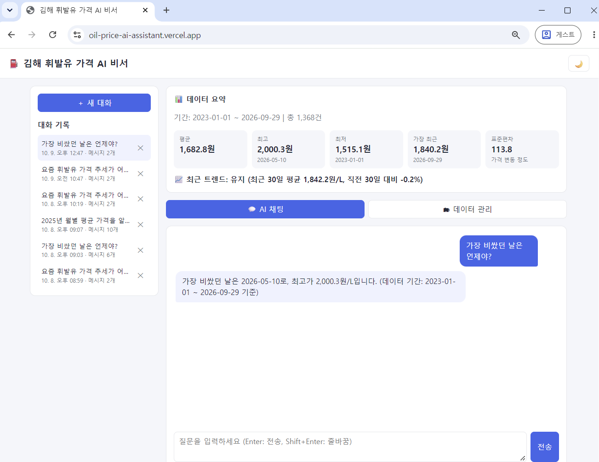
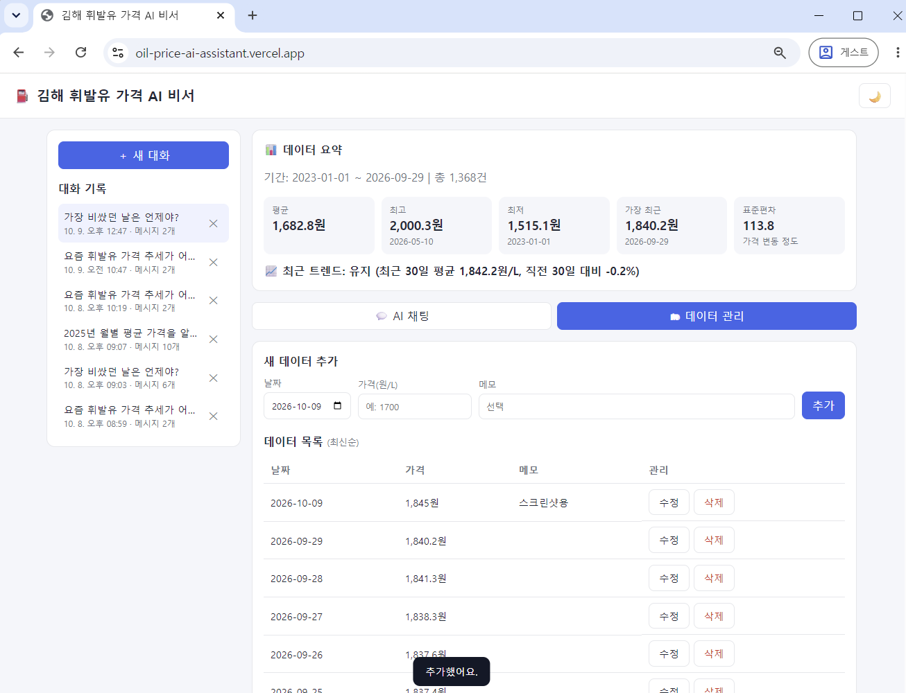
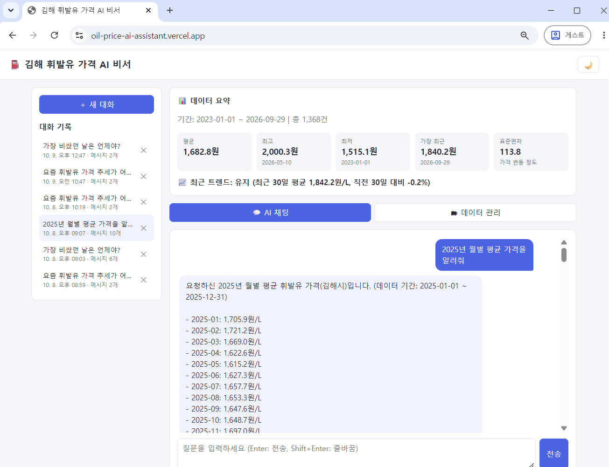
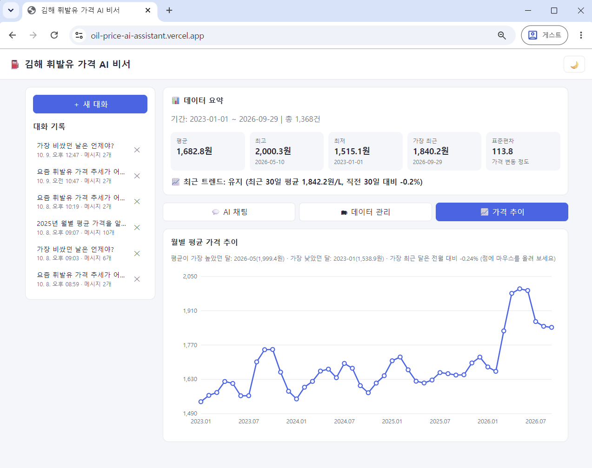

# ⛽ 김해 휘발유 가격 AI 비서

내 데이터를 이해하고 답하는 AI 서비스입니다. 김해시 휘발유 가격 시계열 데이터(2023-01-01 ~ 2026-09-29, 1,368일)를 분석해 요약 정보를 만들고, AI가 이 요약을 근거로 질문에 답합니다.

> 일반적인 챗봇은 내 데이터를 모릅니다. 이 서비스는 **데이터 요약을 시스템 프롬프트에 주입(컨텍스트 주입)** 해서 "지금 가격 추세가 어때?", "가장 비쌌던 날은 언제야?" 같은 질문에 실제 데이터로 답합니다.

## 주요 기능

| 기능 | 설명 |
|---|---|
| 데이터 기반 AI 채팅 | 질문 → 데이터 요약 주입 → GPT 호출 → 답변 (로딩 표시 포함) |
| 데이터 관리 (CRUD) | 날짜·가격·메모를 추가 / 조회 / 수정 / 삭제 |
| 대화 기록 | 대화 자동 저장, 목록 조회, 이전 대화 불러오기, 삭제 |
| 데이터 요약 | 기간, 건수, 평균·최고·최저·최근 가격, 표준편차, 최근 30일 트렌드 |
| 가격 추이 그래프 | 월별 평균 가격 꺾은선 그래프 (점에 마우스를 올리면 평균·최저·최고·전월 대비 변동률 표시) |
| 데이터 내보내기 | 전체 데이터를 CSV 또는 JSON 파일로 다운로드 |
| 다크 모드 | 화면 오른쪽 위 토글 |

## 기술 스택

| 영역 | 사용 기술 |
|---|---|
| 백엔드 | Python, FastAPI, Uvicorn, Pydantic |
| 데이터베이스 | Firebase Firestore (`data`, `conversations` 컬렉션) |
| AI | OpenAI 호환 API (`openai` SDK, Function Calling) |
| 프론트엔드 | HTML, CSS, JavaScript (프레임워크 없음) |
| 배포 | 백엔드: Render / 프론트엔드: Vercel |

## 배포 URL

| 구분 | 주소 |
|---|---|
| 프론트엔드 (Vercel) | https://oil-price-ai-assistant.vercel.app |
| 백엔드 API (Render) | https://oil-price-ai-assistant.onrender.com |
| Swagger UI | https://oil-price-ai-assistant.onrender.com/docs |

> ⏳ **무료 서버 안내**: 백엔드는 Render 무료 플랜이라 한동안 접속이 없으면 잠들고, 첫 요청에 **최대 1분** 정도 걸릴 수 있습니다. 화면에는 응답이 4초 넘게 걸리면 "서버를 깨우는 중이에요" 안내가 표시됩니다. 한 번 깨어난 뒤에는 빠르게 응답합니다.

## 스크린샷

**1. 데이터 요약이 보이는 채팅 화면**



**2. 데이터 관리 화면 (데이터 추가)**



**3. 대화 기록 화면 (이전 대화 불러오기)**



## 동작 원리

### 컨텍스트 주입 (데이터 요약 → 시스템 프롬프트)

```
사용자 질문
   │
   ▼
POST /api/chat
   ├─ ① (이어가는 대화면) conversations에서 이전 대화 불러오기
   ├─ ② 데이터 요약 계산 (기간 / 건수 / 지표 / 트렌드)
   ├─ ③ 요약을 시스템 프롬프트에 삽입
   ├─ ④ GPT 호출
   └─ ⑤ 질문·답변을 conversations에 자동 저장
```

시스템 프롬프트에는 아래와 같은 형태로 요약이 들어갑니다.

```
[사용자 데이터 요약]
- 데이터 기간: 2023-01-01 ~ 2026-09-29
- 총 레코드: 1368개 (하루 1건, 단위: 원/L)
- 주요 지표: 평균 ..., 최고 ...(날짜), 최저 ...(날짜), 가장 최근 ..., 표준편차 ...
- 최근 트렌드: 유지 (최근 30일 평균 ..., 직전 30일 대비 -0.2%)
```

트렌드는 **최근 30일 평균과 직전 30일 평균을 비교**해 ±0.5% 이상이면 상승/하락, 그 안이면 유지로 판단합니다.

### 추가 구현: AI 도구 호출 (Function Calling)

요약만으로 답할 수 없는 세부 질문(특정 기간의 평균, 월별 추이 등)은 AI가 필요한 도구를 직접 호출해 데이터를 조회한 뒤 답합니다.

| 도구 | 용도 |
|---|---|
| `get_price_stats` | 기간의 평균·최고·최저·변동폭 |
| `get_prices` | 짧은 기간의 일별 가격 (최대 60건) |
| `get_monthly_averages` | 월별 평균 (긴 기간의 추세) |

호출 흐름: ① 질문과 요약을 GPT에 전달 → ② 요약으로 부족하면 GPT가 도구 호출을 요청 → ③ 서버가 Firestore 데이터를 조회해 결과 전달 → ④ GPT가 결과를 근거로 최종 답변 (최대 5회 반복). 어떤 도구를 썼는지는 `/api/chat` 응답의 `tools_used`와 채팅 화면의 "🔧 추가 조회" 표시로 확인할 수 있습니다.

> MCP Server / GPT Actions 연동은 구현하지 않았습니다.

### 추가 구현: 시각화와 내보내기

- **추가 지표**: 요약에 표준편차(가격 변동 정도)와 최근 30일 평균을 추가했고, 월별 통계에는 전월 대비 변동률을 제공합니다.
- **그래프**: 외부 라이브러리 없이 SVG를 직접 그려 월별 평균 추이를 보여 줍니다. 색상을 CSS 변수로 지정해 다크 모드에서도 자동으로 바뀝니다.
- **내보내기**: 서버가 `Content-Disposition: attachment` 헤더로 응답하므로 버튼을 누르면 바로 파일이 내려받아집니다. CSV는 맨 앞에 BOM을 넣어 엑셀에서 한글 메모가 깨지지 않습니다.
- 통계와 내보내기도 메모리 캐시를 사용하므로 Firestore 읽기를 추가로 소모하지 않습니다.

**4. 가격 추이 그래프**



### 비용 절약 (Firestore 읽기 캐시)

Firestore는 읽은 문서 수만큼 무료 한도가 줄어듭니다. 전체 데이터(1,368건)를 서버 메모리에 5분간 보관하고, 데이터가 추가·수정·삭제되면 즉시 비워서 요약과 AI 답변에 바로 반영되도록 했습니다.

## API 목록

Swagger UI(`/docs`)에서 직접 호출해 볼 수 있습니다.

| 메서드 | 경로 | 설명 |
|---|---|---|
| POST | `/api/data` | 새 데이터 추가 (같은 날짜는 409) |
| GET | `/api/data` | 목록 조회 (`start_date`, `end_date`, `order`, `limit`, `offset`) |
| PUT | `/api/data/{id}` | 데이터 수정 (보낸 필드만 변경) |
| DELETE | `/api/data/{id}` | 데이터 삭제 |
| GET | `/api/data/summary` | 데이터 요약 (프롬프트 주입용) |
| GET | `/api/data/statistics` | 월별 통계: 평균·최저·최고·전월 대비 변동률 (그래프용) |
| GET | `/api/data/export` | 데이터 내려받기 (`format=csv` 또는 `json`, 기간 필터 가능) |
| POST | `/api/chat` | AI 대화 (`message`, 선택 `conversation_id`) |
| POST | `/api/conversations` | 대화 저장 |
| GET | `/api/conversations` | 대화 목록 (본문 대신 `message_count` 포함) |
| GET | `/api/conversations/{id}` | 특정 대화의 전체 메시지 조회 |
| DELETE | `/api/conversations/{id}` | 대화 삭제 |

입력 값은 Pydantic으로 검증합니다. (날짜는 `YYYY-MM-DD` 형식, 가격은 0보다 큰 값, 질문은 1~1000자)

## 폴더 구조

```
.
├── backend/
│   ├── main.py                  # FastAPI 앱, CORS, 라우터 등록
│   ├── config.py                # 환경 변수 읽기
│   ├── firebase_client.py       # Firestore 연결
│   ├── schemas.py               # Pydantic 모델 (요청/응답 검증)
│   ├── load_data.py             # CSV → Firestore 적재 스크립트
│   ├── routers/                 # data.py, chat.py, conversations.py
│   ├── services/                # data_service.py(요약·캐시), ai_service.py, conversation_service.py
│   └── requirements.txt
├── frontend/                    # index.html, style.css, app.js, config.js
└── .env.example                 # 환경 변수 견본
```

## 로컬 실행 방법

사전 준비: Python 3.10 이상, Firebase 프로젝트(Firestore 활성화)와 서비스 계정 키, OpenAI 호환 API 키

### 1. 환경 변수 파일 만들기

`.env.example`을 복사해 프로젝트 맨 위 폴더에 `.env`를 만들고 값을 채웁니다. 서비스 계정 키 파일은 `backend/serviceAccountKey.json`에 둡니다. (둘 다 `.gitignore`로 제외되어 GitHub에는 올라가지 않습니다.)

### 2. 백엔드 실행 (PowerShell)

```powershell
cd backend
python -m venv venv
.\venv\Scripts\Activate.ps1
pip install -r requirements.txt
python load_data.py          # 최초 1회: CSV 데이터를 Firestore에 적재
uvicorn main:app --reload
```

→ http://127.0.0.1:8000/docs 에서 Swagger UI 확인

### 3. 프론트엔드 실행 (새 터미널)

```powershell
cd frontend
python -m http.server 5500
```

→ http://localhost:5500 접속 (`frontend/config.js`의 `API_BASE_URL`이 로컬 백엔드를 가리킵니다.)

## 환경 변수

### 백엔드 (`.env` 또는 Render 환경 변수)

| 이름 | 설명 | 예시 |
|---|---|---|
| `OPENAI_API_KEY` | AI API 키 | (비공개) |
| `OPENAI_BASE_URL` | OpenAI 호환 API 주소 | `https://copa.codyssey.kr/v1` |
| `OPENAI_MODEL` | 사용할 모델 이름 | `gpt-5-mini` |
| `FIREBASE_SERVICE_ACCOUNT_JSON` | 서비스 계정 키 파일의 **내용 전체** (배포용) | `{ "type": "service_account", ... }` |
| `FIREBASE_SERVICE_ACCOUNT_PATH` | 서비스 계정 키 파일 경로 (로컬용, JSON 변수가 없을 때 사용) | `serviceAccountKey.json` |
| `ALLOWED_ORIGINS` | CORS 허용 도메인 (쉼표로 구분) | `https://oil-price-ai-assistant.vercel.app,http://localhost:5500` |

### 프론트엔드 (Vercel 환경 변수)

| 이름 | 설명 | 예시 |
|---|---|---|
| `API_BASE_URL` | 백엔드 API 주소 (끝에 `/` 없음) | `https://oil-price-ai-assistant.onrender.com` |

## 배포 방법 요약

### 백엔드 → Render (Web Service)

| 항목 | 값 |
|---|---|
| Root Directory | `backend` |
| Build Command | `pip install -r requirements.txt` |
| Start Command | `uvicorn main:app --host 0.0.0.0 --port $PORT` |
| 환경 변수 | 위 백엔드 표 + `PYTHON_VERSION` |

### 프론트엔드 → Vercel

| 항목 | 값 |
|---|---|
| Framework Preset | Other |
| Root Directory | `frontend` |
| Build Command | `echo "window.API_BASE_URL='$API_BASE_URL';" > config.js` |
| Output Directory | `.` |
| 환경 변수 | `API_BASE_URL` |

Build Command가 배포할 때마다 `config.js`를 환경 변수 값으로 새로 만들기 때문에, 코드를 고치지 않고 API 주소를 바꿀 수 있습니다.

## 보안

- API 키와 서비스 계정 키는 모두 환경 변수로 관리하고 코드와 저장소에는 포함하지 않습니다. (`.gitignore`로 제외)
- CORS는 배포한 프론트엔드 도메인만 허용합니다.
- 화면에 표시하는 모든 텍스트는 `textContent`로 삽입해 XSS를 방지합니다.
